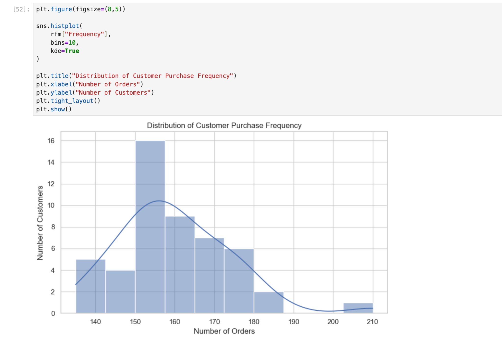
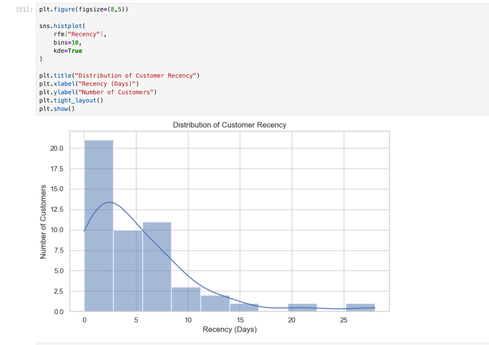
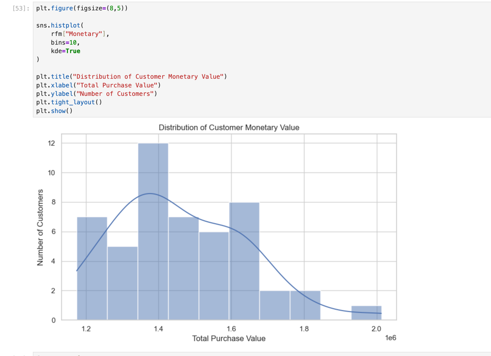
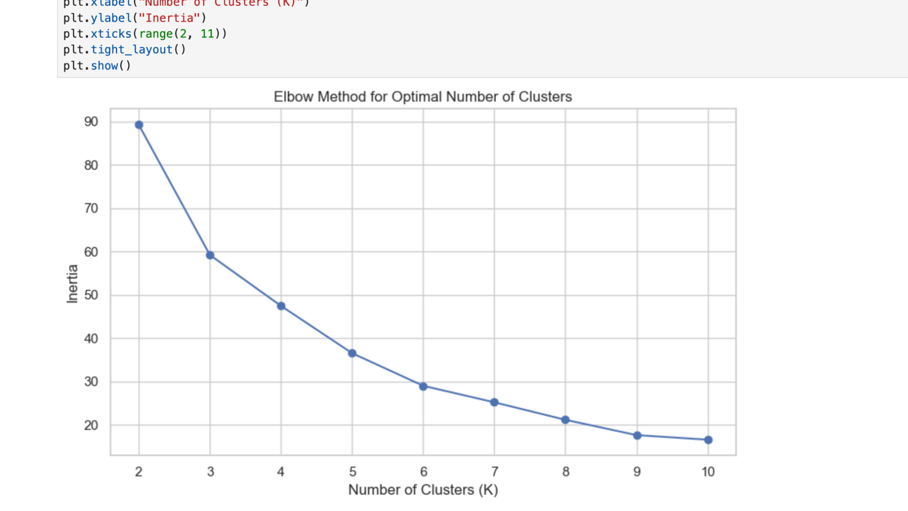
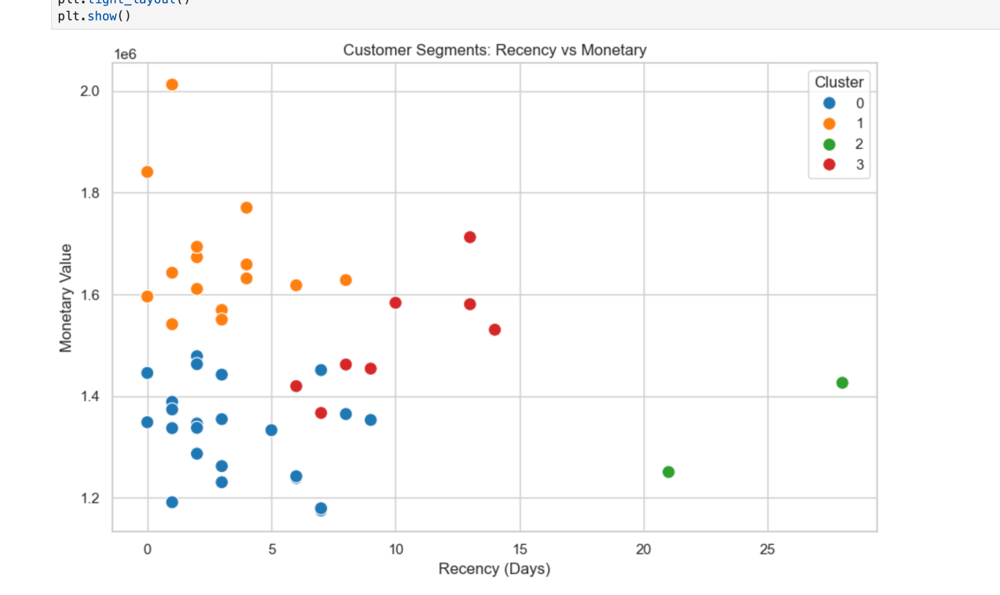
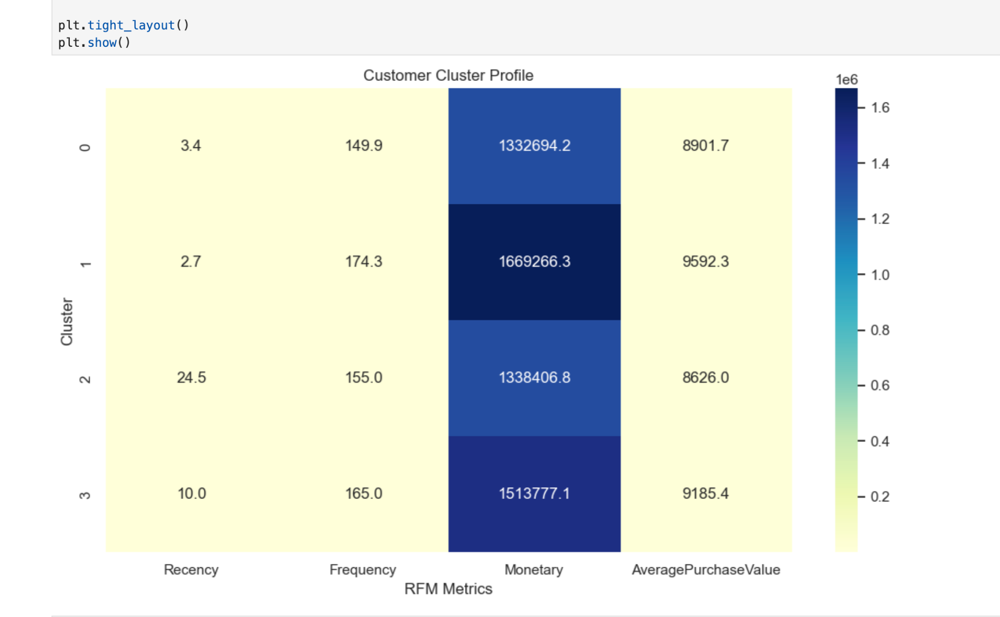

# 📊 Customer Segmentation & RFM Analysis

<p align="center">
  <strong>Customer Analytics Project using Python, RFM Analysis & K-Means Clustering</strong>
</p>

<p align="center">
  
  
  
  
</p>

---

## 🧭 Project Overview

This project focuses on **customer segmentation and purchasing behaviour analysis** using **RFM (Recency, Frequency, Monetary) analysis** and **K-Means clustering**.

The objective is to transform transaction-level data into meaningful customer segments that can help a business make better decisions around **customer retention, loyalty, targeted marketing, cross-selling and re-engagement**.

---

## 🎯 Business Objective

Businesses often have customers with very different purchasing behaviours. Treating every customer in the same way can lead to inefficient marketing and missed revenue opportunities.

This project answers questions such as:

- 🕒 Which customers purchased most recently?
- 🛒 Which customers purchase most frequently?
- 💰 Which customers generate the highest purchase value?
- 👥 Can customers be grouped according to similar purchasing behaviour?
- 🎯 How can these segments support targeted marketing strategies?

---

## 📁 Dataset

The complete dataset used in this analysis is included directly in this repository:

📄 **[sales_data.csv](./sales_data.csv)**

The dataset is used to calculate customer-level RFM metrics and perform segmentation.

> **Note:** This repository contains the dataset used for the project, so no external dataset download is required.

---

## 🔍 Methodology

The project follows an end-to-end analytics workflow:

```text
Raw Transaction Data
        ↓
Data Cleaning & Exploration
        ↓
RFM Feature Engineering
        ↓
Feature Scaling
        ↓
Elbow Method
        ↓
K-Means Clustering
        ↓
Cluster Profiling
        ↓
Business Insights & Recommendations
```

### 1️⃣ Recency

Measures the number of days since a customer's most recent purchase.

**Lower Recency = More Recently Active Customer**

### 2️⃣ Frequency

Measures the number of orders placed by a customer.

**Higher Frequency = More Engaged Customer**

### 3️⃣ Monetary

Measures the total purchase value generated by a customer.

**Higher Monetary Value = Higher Customer Value**

---

## 🤖 Customer Segmentation

K-Means clustering was applied to the RFM metrics after feature scaling.

### 📐 Optimal Number of Clusters

The **Elbow Method** was used to compare different values of K.

The analysis selected:

### **K = 4**

This resulted in four customer segments with different purchasing behaviours.

---

## 👥 Customer Cluster Profile

| Cluster | Recency | Frequency | Monetary Value | Business Interpretation |
|:------:|--------:|----------:|---------------:|--------------------------|
| **0** | 3.4 | 149.9 | 1,332,694.2 | Frequent customers with comparatively lower monetary value |
| **1** | 2.7 | 174.3 | 1,669,266.3 | ⭐ Highest-frequency and highest-value segment |
| **2** | 24.5 | 155.0 | 1,338,406.8 | ⚠️ Less recent customers requiring re-engagement |
| **3** | 10.0 | 165.0 | 1,513,777.1 | 💎 Strong-value customers with moderate recency |

> **Note:** Cluster numbers are identifiers generated by K-Means and do not represent an inherent ranking.

---

## 💡 Key Business Insights

### ⭐ High-Value Customers — Cluster 1

Cluster 1 has the highest average **Frequency** and **Monetary Value**.

**Recommended strategy:**
- Loyalty rewards
- VIP offers
- Personalized recommendations
- Retention campaigns

### ⚠️ At-Risk Customers — Cluster 2

Cluster 2 has significantly higher **Recency**, indicating customers who have not purchased recently.

**Recommended strategy:**
- Win-back campaigns
- Personalized discounts
- Email/SMS re-engagement
- Limited-time offers

### 💎 Strong-Value Customers — Cluster 3

Cluster 3 combines strong purchase frequency and monetary value with moderate recency.

**Recommended strategy:**
- Cross-selling
- Upselling
- Loyalty benefits
- Personalized product recommendations

### 🛒 Frequent Customers — Cluster 0

Cluster 0 shows strong purchasing frequency but comparatively lower monetary value.

**Recommended strategy:**
- Increase average order value
- Product bundles
- Cross-selling
- Upselling

---

## 📊 Visualizations

### 🕒 Recency Distribution



### 🛒 Frequency Distribution



### 💰 Monetary Value Distribution



### 📐 Elbow Method



### 👥 Customer Segments



### 🔥 Customer Cluster Profile



---

## 🛠️ Tech Stack

| Technology | Purpose |
|---|---|
| 🐍 **Python** | Data analysis & modelling |
| 🐼 **Pandas** | Data manipulation |
| 🔢 **NumPy** | Numerical operations |
| 📊 **Matplotlib** | Data visualization |
| 📈 **Seaborn** | Statistical visualization |
| 🤖 **Scikit-learn** | Feature scaling & K-Means |
| 📓 **Jupyter Notebook** | Analysis environment |

---

## 📂 Repository Structure

```text
customer-segmentation-rfm-analysis/
│
├── 📓 Customer_Segmentation_Analysis.ipynb
├── 📄 sales_data.csv
├── 📄 README.md
├── 📄 requirements.txt
│
├── 🖼️ recency.png
├── 🖼️ frequency.png
├── 🖼️ monetary.png
├── 🖼️ elbow.png
├── 🖼️ customer_segments.png
└── 🖼️ cluster_profile.png
```

---

## 🚀 How to Run

### 1. Clone the repository

```bash
git clone https://github.com/ambuj9905/customer-segmentation-rfm-analysis.git
```

### 2. Open the project folder

```bash
cd customer-segmentation-rfm-analysis
```

### 3. Install the required libraries

```bash
pip install -r requirements.txt
```

### 4. Launch Jupyter Notebook

```bash
jupyter notebook
```

Open:

```text
Customer_Segmentation_Analysis.ipynb
```

---

## 📌 Project Outcome

This project demonstrates an end-to-end approach to **customer analytics and unsupervised machine learning**.

By combining RFM analysis with K-Means clustering, transaction data is transformed into actionable customer segments that can support:

- 🎯 Targeted marketing
- ❤️ Customer retention
- 🏆 Loyalty programs
- 🛍️ Cross-selling
- 📈 Upselling
- 🔄 Customer re-engagement

---

## 👨‍💻 About Me

### **Ambuj Singh**
**Aspiring Data Analyst | Python | SQL | Power BI | Data Analytics**

I'm building practical data analytics projects focused on turning raw data into meaningful business insights.

### 🔗 Connect With Me

- 💼 **LinkedIn:** [Ambuj Singh](https://www.linkedin.com/in/ambuj-singh-02a300281/)
- 🐙 **GitHub:** [ambuj9905](https://github.com/ambuj9905)

---

## ⭐ If you find this project useful

Feel free to explore the notebook, review the analysis, and connect with me on LinkedIn.

**Thank you for visiting! 🚀**
